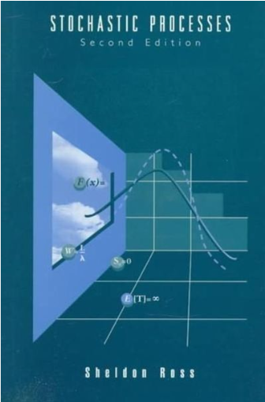

## Applied Stochastic Processes (추계적 과정)

### Overview

- These materials are derived from lecture IMEN666, [Prof. Young Myoung Ko](https://www.lstlab.org/home)
- This course is based on Stochastic Processes, 2nd edition.
- 

### Contents

- **Chapter 1: Preliminaries**
  - Probability measure (Borel-Cantelli Lemma)
  - Random variables
  - Expected value
  - Generating functions and Laplace transform
  - Conditional expectation
  - Exponential distribution
  - Some probability inequalities (Markov inequality, Jensen's inequality, Chevysev's inequality)
  - Limit theorem (Weak law of large numbers (WLLN), Strong law of large numbers (SLLN))
- **Chapter 2: Poisson process**
  - The Poisson process
  - Interarrival and waiting time distributions
  - Conditional distribution of the arrival times
  - Nonhomogeneous Poisson process
  - Compound Poisson random variables and processes 
- **Chapter 3: Renewal theory**
  - Introduction and preliminaries
  - Distribution of $N(t)$
  - Some limit theorems
  - The key renewal theorem and applications
  - Delayed renewal processes
  - Renewal reward processes
  - Regenerative processes
- **Chapter 4: Markov Chains**
  - Introduction and examples
  - Chapman-Kolmogorov equations / classification of states
  - Limit theorems
  - Timie-reversible Markov chains
  - First Passage Time

